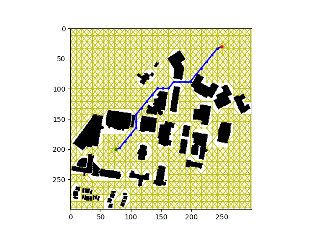
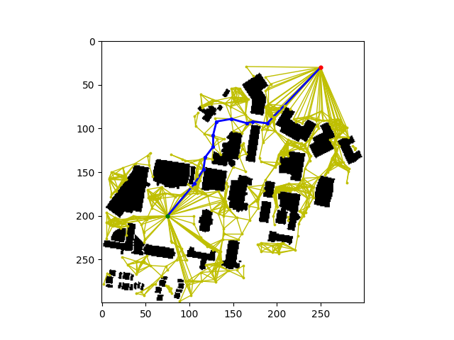
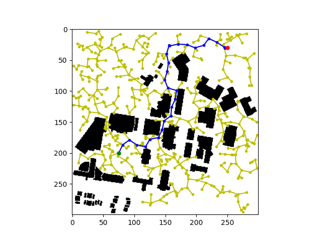
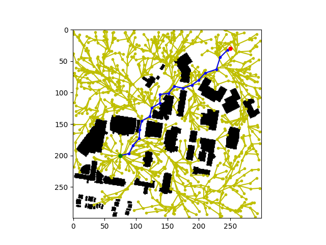
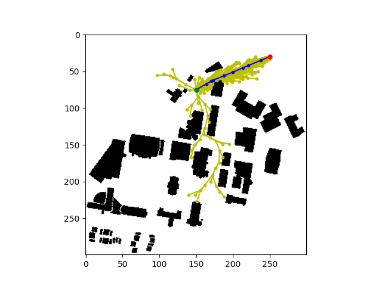

# RBE 550 - Sampling based Search Algorithms Implementation

## Overview

This repo considt of implementation of Probabilistic Road map (PRM) approach, Rapidly-exploring Random Tree (RRT, RRT*, Informed*) in python.

To generate path, Run:
`python main.py` for PRM, RRT, RRT*.
`python main_informed_RRT.py` for Informed RRT*

## Results

### Uniform

    
     

### Gaussian

    
     

### RRT

    
     

### RRT*

    
     

### Informed RRT*

    
     

